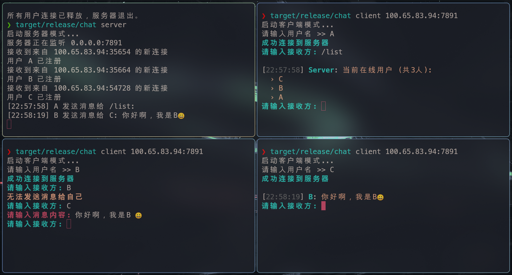
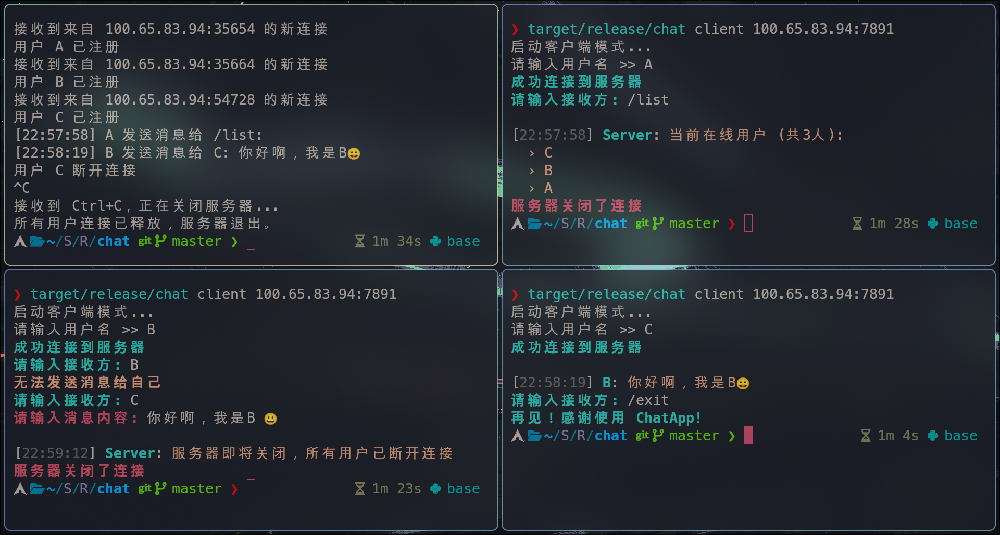

# 💬 Async Chat Room 

## 🌟 功能特性
| 功能                  | 描述                             |
|----------------------|----------------------------------|
| 多用户支持            | 支持同时在线多用户          |
| 离线通知              | 自动检测用户离线状态               |
| 异步通信              | 基于Tokio的高效网络模型            |
| 跨平台                | 支持Windows/Linux/macOS          |
| 高并发处理 | 利用DashMap构建细粒度锁，实现读写分离 |

## 🛠️ 技术栈
- **异步运行时**: Tokio
- **数据结构**: DashMap
- **序列化**: Serde JSON
- **网络协议**: TCP协议

## 📦 安装指南

```bash
$ git clone https://github.com/sleep-bit/async-chat.git
$ cd async-chat
$ cargo build --release
```

## 📂 项目结构
```
async-chat/
├── src/
│   ├── server.rs        # 服务器核心逻辑
│   ├── client.rs        # 客户端实现
│   └── lib.rs           # 共享数据结构
├── images/
│   ├── chat.png     # 局域网连接示例
│   └── exit-notify.png     # 服务器退出通知示例
├── Cargo.toml
└── README.md
```

## 🚀 核心功能演示

### 1. 局域网连接


输入`/list`指令实现聊天室在线人数及其相关信息查询。

同时可以选择相应用户发送信息。

### 2. 安全退出机制


可以通过指令`/exit`在客户端实现聊天室退出功能。服务器自动检测信号，通过`Ctrl+C`实现退出功能，同时向在线用户发送通知，释放在线用户资源。

## 📡 网络配置说明

### 服务器端口配置
| 配置项       | 默认值       | 说明                     |
|-------------|-------------|-------------------------|
| 绑定地址     | 0.0.0.0     | 监听所有网络接口           |
| 端口号       | 7891        | 需确保防火墙开放此端口      |

需要说明的是，当前项目客户端连接的IP地址为IPv4地址。客户端连接网络时需要使用相应IP地址。

### 局域网连接示例

```bash
# 假设服务器IP为 192.168.1.100
客户端连接命令：
$ cd chat
$ cargo build --release # 实现文件编译，生成可执行文件  
$ target/release/chat server # 默认端口为7891,可以修改server.rs文件修改 
$ target/release/chat client 192.168.1.100:7891 # 当不设置IP地址时默认为本地IP  
````

## ⌨️ 指令系统手册

### 基础指令
| 指令            | 功能描述                     | 示例                     |
|----------------|----------------------------|-------------------------|
| `/list`        | 查看在线用户列表             | `/list`                 |
| `/exit`        | 安全退出聊天室               | `/exit`                 |

## 🛠️ 完整使用指南

```bash
# 假设服务器IP为 192.168.1.100
客户端连接命令：
$ cd chat
$ cargo build --release # 实现文件编译，生成可执行文件  
$ target/release/chat server # 默认端口为7891,可以修改server.rs文件修改 
$ target/release/chat client 192.168.1.100:7891 # 当不设置IP地址时默认为本地IP  
```

## 🌐 IP地址查询指南

### Windows系统
1. 按 `Win+R` 打开运行窗口
2. 输入 `cmd` 打开命令提示符
3. 执行命令：
```bat
> ipconfig | findstr "IPv4"
```

### Linux系统
1. 打开终端
2. 执行命令：
```bash
$ ip -4 addr show | grep inet
# 或使用快捷命令
$ hostname -I
```

## ⚠️ 网络注意事项
1. 确保服务器和客户端在同一局域网段
2. 检查路由器防火墙设置
3. 推荐使用静态IP分配
4. 避免使用保留端口（<1024）
5. 连接IP地址使用IPv4
6. 服务器端口默认7891

